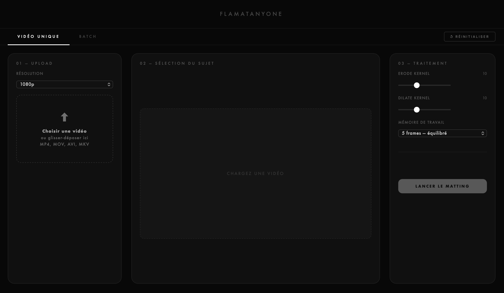

# Flamatanyone

A custom web interface for [MatAnyone 2](https://github.com/pq-yang/MatAnyone2), built on top of the original project by pq-yang. Replaces the Gradio demo with a fast dark web UI served locally via FastAPI.



## Features

- **Single video mode** — upload, annotate with clicks, launch matting
- **Batch mode** — queue multiple videos, annotate each, process sequentially with a download-all button
- **Bidirectional propagation** — annotate any frame; the model propagates forward and backward from that point
- **Multi-mask support** — several subjects per video, color-coded chips
- **Resolution control** — Original / 1152p / 1080p / 720p / 540p / 480p
- **Fast timeline scrubbing** — preview frames instantly, SAM encodes only on release
- **Settings tab** — configure input/output folders, purge old files by date

## Installation

```bash
git clone https://github.com/gasparmatheron/Gas-MatAnyone2
cd Gas-MatAnyone2
bash install.sh
```

`install.sh` handles everything: conda env creation, PyTorch (MPS on macOS, CUDA on Linux), dependencies, and model weight download.

## Usage

```bash
bash run.sh
```

Then open [http://localhost:7860](http://localhost:7860) in your browser.

Custom port:
```bash
PORT=8080 bash run.sh
```

## Project structure

```
hugging_face/
├── custom_index.html       # UI (single file, no build step)
├── custom_server.py        # FastAPI backend
├── matanyone2_wrapper.py   # Bidirectional matting logic
└── tools/                  # Utilities from original MatAnyone project
install.sh                  # One-shot install script
run.sh                      # Launch script
```

## Credits

- **MatAnyone 2** — [pq-yang](https://github.com/pq-yang/MatAnyone2), S-Lab NTU
- **Custom interface** — [Gaspar Matheron](https://gasparmatheron.studio)

## License

Based on [MatAnyone 2](https://github.com/pq-yang/MatAnyone2), licensed under [NTU S-Lab License 1.0](./LICENSE).
